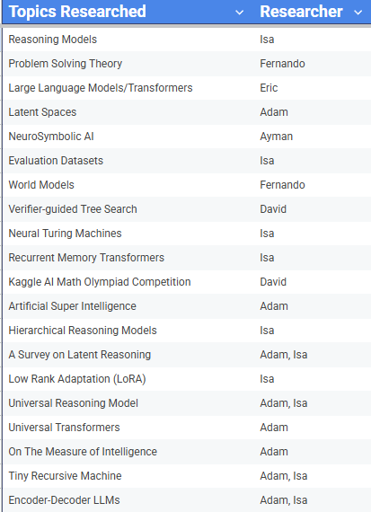

# Research Phase

The first 4 weeks were spent researching AGI, ASI, LLMs, reasoning models, neurosymbolic AI, latent spaces, world models, search algorithms, and much more. The goal was to understand the problem space of what is a reasoning model, how do they work, what is a good benchmark for them, and what are the most modern developments towards reasoning models.

---

A good place to start becoming familiar with the concepts of AGI and ASI is our presentation on ASI.

### ASI Presentation: [Link](https://docs.google.com/presentation/d/1lsefZSfWkEJc93auCGzUcU3V_nckuyRYuZWWR-k0gm4/edit?slide=id.p#slide=id.p)

---

Find our research board at this link, next to each topic researched there is a link to the document containing notes.

### Research Board: [Link](https://docs.google.com/spreadsheets/d/1j6mUUsUZdEdaee9SRqwCKoRnMpBY2YfAa4C3YrOXD0w/edit?gid=0#gid=0)

