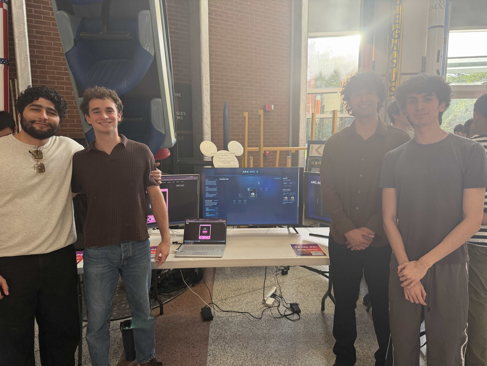

# Demonstration

Finally, we presented our work at Project Launch's Demo Day. We placed 5th out of 35 other teams. We created a frontend to visualize the world model, a research paper to summarize our work and philosophy, and a presentation to tell the story of our progress. There is much more to come for our work on reasoning models.

### Frontend: [Link](https://singularity-frontend-phi.vercel.app/)

### Demo Presentation [Link](https://docs.google.com/presentation/d/1IL5LJGhlGtw2tNFJDSRS7U9qZ0Ye3qOKb16n4WY_Eeo/edit?slide=id.p#slide=id.p)

### Paper: [Link](https://docs.google.com/document/d/143z_4DuMYBArYA1ShIh96vl6WGUfbbPgOpwHn57_EHI/edit?usp=sharing)

Project Launch Demo Day
