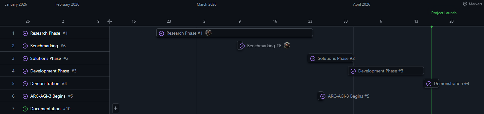

# Welcome to Singularity!

### What is Singularity?
Singularity is a research project that was active during January 2026 - April 2026, with a focus on the research & development of a novel & custom reasoning AI model.

---

### What is Reasoning?
Reasoning by definition is the process of using logic, existing knowledge, and new information to think critically, draw conclusions, make inferences, or construct arguments.
* Intelligence: the ability to efficiently learn new skills and knowledge

---

### Why Develop Reasoning Models?
The original purpose of Artifical Intelligence is to build computer systems that are capable of solving humanity's hardest problems for us. We believe that reasoning is at the core of problem solving, therefore the most efficacious approach towards building powerful & useful AI. 

---

### What's Wrong with Current Reasoning Models?
Reasoning models are currently directly tied with Large Language Models. These models, which are our most generally intelligent model to date (early 2026) have previously used Chain of Thought Prompting as their method of inducing reasoning out of the model. We argue that this inherit language based reasoning is limiting the model's potential to solve complex problems.

---

### How to Measure Reasoning?
There are many strong benchmarks publicly available for testing reasoning, but the one we found the most interesting was [ARC Prize's ARC-AGI](https://arcprize.org/competitions/2026), which stands for "Abstract Reasoning Corpus". We found it particularly unique because the benchmark is very clearly "Easy for Humans, hard for AI" as they claim. This is because inference time learning is paramount.

---

### Singularity Project Timeline:

This project was split into 4 phases:
1. [Research Phase](/docs/Project%20Launch/1.%20Research%20Phase/README.md)
2. [Solutions Phase](/docs/Project%20Launch/2.%20Solutions%20Phase/README.md)
3. [Development Phase](/docs/Project%20Launch/3.%20Development%20Phase/README.md)
4. [Demonstration](/docs/Project%20Launch/4.%20Demonstration/README.md)

## Project Launch
Project Launch was a 2 month long competition that involved 2 checkpoints and a demo. Reading through our presentations for each of these events tells a story of progress that can help you better understand our research project.

### Checkpoint 1: [Link](https://prezi.com/p/z5pq6efab5s3/?present=1)
### Checkpoint 2: [Link](https://docs.google.com/presentation/d/1GPHV_77KpA9nhNzltor8zZnKNNglN8caOz-pPhitwIc/edit?slide=id.p#slide=id.p)
### Demonstration: [Link](https://docs.google.com/presentation/d/1IL5LJGhlGtw2tNFJDSRS7U9qZ0Ye3qOKb16n4WY_Eeo/edit?slide=id.p#slide=id.p)

### Paper: [Link](https://docs.google.com/document/d/143z_4DuMYBArYA1ShIh96vl6WGUfbbPgOpwHn57_EHI/edit?usp=sharing)